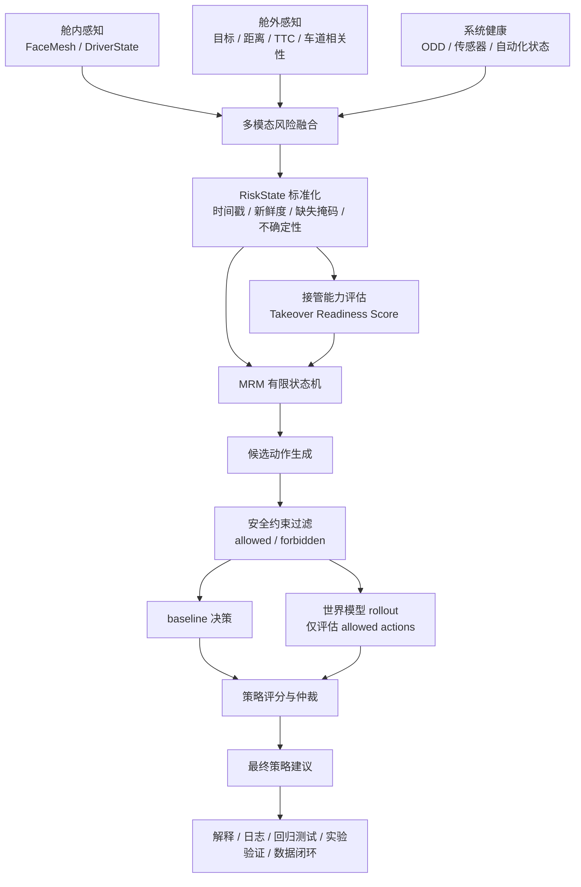

# AegisDrive

面向辅助驾驶失效接管场景的舱内外协同风险评估与最小风险策略推演系统

本 README 定位为 AegisDrive 的科研级系统方案与仓库技术说明书。文档先描述完整系统设计，再说明当前仓库已经实现的参考原型。当前代码覆盖舱内外感知、风险融合、RiskState 适配、MRM baseline、mock / paper-style 世界模型推演和演示测试；不包含训练型 learned world model、真实车辆底盘控制接口、真实车辆实验或已训练性能指标。

## 1. 项目概述

AegisDrive 面向辅助驾驶系统在 ODD 退出、传感器退化、系统故障、前向碰撞风险升高等场景中的失效接管问题。系统关注的核心不是“是否发出接管请求”，而是“驾驶员此刻能否安全接管，以及系统应采取什么最小风险策略”。

完整系统链路为：

```text
多模态风险感知
-> RiskState 标准化
-> 接管能力评估
-> MRM 状态机
-> 候选动作生成
-> 安全约束过滤
-> baseline 决策
-> 世界模型 action-conditioned rollout
-> 策略评分和仲裁
-> 解释、日志、实验验证和数据闭环
```

系统输出策略建议、风险推演和解释日志，不直接控制真实车辆底盘。它不是完整自动驾驶系统、单纯疲劳检测、单纯碰撞预警或单纯世界模型演示。

## 2. 问题定义与研究目标

辅助驾驶系统可能在施工区域、恶劣天气、车道线缺失、前车急减速、目标遮挡、传感器退化或系统故障时退出设计运行域。此时传统视觉/声音接管请求并不充分：驾驶员可能疲劳、分心、闭眼、无响应、双手未准备或反应迟缓。

Minimum Risk Maneuver（MRM）和 Minimum Risk Condition（MRC）的研究价值来自这种中间状态：系统不能继续可靠自动驾驶，驾驶员也未必能立即接管。AegisDrive 的目标是在多源风险不确定、接管能力动态变化、候选动作受硬约束限制的情况下，形成保守、可解释、可验证、可回退的最小风险策略。

## 3. 系统目标与边界

完整系统输入包括：

- 驾驶员状态：`has_face`、`driver_available`、`monitoring_valid`、PERCLOS、闭眼、哈欠、点头、分心、头姿、视线、无响应、双手和响应时延。
- 道路风险：目标检测、前车距离、TTC、相对速度、车道相关性、侧向可用性、路肩可用性、后向风险和感知置信度。
- 系统健康：自动化状态、系统故障、ODD 退出、传感器退化、时间戳、新鲜度和配置/模型版本。
- 可扩展输入：历史 RiskState、候选动作、地图、轨迹、BEV、occupancy、自车状态和交通参与者历史轨迹。

完整系统输出包括 `RiskState`、Takeover Readiness、MRM FSM 状态、allowed / forbidden actions、baseline 推荐、1/3/5 秒风险、MRC 可达性、最终策略、解释和日志。当前仓库只实现策略建议和演示推演，不提供制动、转向、CAN 或真实底盘执行能力。

## 4. 总体架构



架构中 baseline 是安全兜底，世界模型只在安全过滤后的动作集合上做预测排序。若世界模型不可用或输出异常，系统按 `learned -> paper/mock -> baseline` 回退。

## 5. IDMS 与 AegisDrive 的关系

原 IDMS 负责舱内外感知和当前风险融合：舱内模块检测人脸、疲劳、哈欠、分心和头姿；舱外模块检测车辆目标、估计距离、计算 TTC 和碰撞预警；融合模块形成当前综合风险。

AegisDrive 在 IDMS 之上增加 RiskState、TRS、MRM、MRC、候选策略、安全过滤、世界模型、仲裁和日志闭环。可以概括为：

> IDMS 回答当前风险是什么；AegisDrive 回答驾驶员能否接管以及系统应采取什么最小风险策略。

当前仓库中，`mrm_demo/live_adapter.py` 是两者之间的接口层。它把 `face_data`、`driver_state`、`vehicle_data`、`fusion_result` 和 `system_status` 转换为 `RiskState`，但不负责最终策略。

## 6. 舱内驾驶员状态建模

舱内状态不是单一疲劳分数，而是接管能力证据集合。完整系统应联合以下信号：

- 可见性与有效性：`has_face`、`driver_available`、`monitoring_valid`、`unavailable_reason`。
- 眼部与疲劳：EAR、闭眼持续时间、眨眼事件、PERCLOS、眨眼频率、疲劳评分。
- 嘴部与姿态：MAR、哈欠、点头、yaw / pitch / roll。
- 注意力与接管准备：分心持续时间、视线偏移、低头、无响应、响应时延、双手状态。
- 置信度：单信号、互相印证、矛盾信号和监测不可用。

P0 安全语义：无人脸不一定等于疲劳，也不应伪造成闭眼或分心；但无人脸意味着接管能力不可可靠判断，不能返回零风险。当前 `src/internal/face_mesh.py` 在无人脸或空帧时返回 `driver_available=False`、`monitoring_valid=False` 和 `unavailable_reason`；`src/internal/driver_state.py` 对该状态给出非零驾驶员风险，并保持疲劳/注意力分项为 0。

## 7. 舱外道路风险建模

完整系统的舱外风险包括目标检测、前车距离、TTC、相对速度、车道相关性、侧向可用性、路肩可用性、后向风险、感知置信度和时间同步。当前仓库实现的是原型级链路：

- `src/external/yolo_detector.py`：YOLOv8 车辆类检测，关注 car、motorcycle、bus、truck。
- `src/external/distance_est.py`：基于单目相似三角形估计距离，支持类别宽度和 EMA 平滑。
- `src/external/collision_warn.py`：用基础帧间匹配估计相对速度和 TTC，并按车道相关性降级风险。

单目测距和基础跟踪适合原型演示。研究级系统需要相机标定、多传感器融合、稳定多目标跟踪、时间同步、自车速度、目标轨迹预测和可量化不确定性。

## 8. 多模态融合与 RiskState

RiskState 是 MRM 决策和世界模型推演的统一输入。完整系统中应包含：

- `DriverState`：驾驶员接管能力、监测有效性和不可用原因。
- `RoadState`：前向目标、距离、TTC、相对速度、车道、路肩、侧向和后向风险。
- `SystemState`：系统故障、ODD 退出、传感器退化、自动化状态和感知置信度。
- `FusionResult`：舱内、舱外、交叉项、综合风险、风险等级和告警紧急度。

每类状态都应带有时间戳、新鲜度、来源、缺失值、有效性掩码和不确定性。缺失、未知和过期状态不能自动等价为安全状态。

当前仓库中，`src/core/risk_fusion.py` 输出 `FusionResult`，包含 `ext_score`、`int_score`、`cross_score`、`fused_score`、`fused_level`、`driver_available`、`monitoring_valid` 和 `unavailable_reason`。`mrm_demo/risk_state.py` 定义 MRM demo 使用的结构化状态和 `RiskAssessment`。

## 9. 接管能力评估

Takeover Readiness Score（TRS）衡量驾驶员能否承担接管，而不是疲劳检测的同义词。完整系统应联合 `driver_available`、`monitoring_valid`、疲劳、注意力、无响应、双手、响应时延、道路剩余时间和系统状态。

| TRS | 含义 | 典型证据 | 策略含义 |
|---|---|---|---|
| 3 | 可接管 | 人脸可见、注意力稳定、反应快、双手可用 | 可优先请求接管 |
| 2 | 有条件可接管 | 轻度疲劳或短时分心，但仍有响应 | 接管请求需配合提醒和保守准备 |
| 1 | 接管能力不足 | 疲劳、分心、响应迟缓或道路风险较高 | 不能只依赖接管请求 |
| 0 | 不可接管 | 无人脸、无响应、监测不可用或接管请求未响应 | 进入 MRM 执行或安全停车策略 |

当前 `mrm_demo/risk_state.py` 的 `compute_takeover_readiness()` 使用闭眼、PERCLOS、哈欠、分心、头姿、无响应、响应时延、双手和接管请求状态计算 TRS。`mrm_demo/live_adapter.py` 会在驾驶员不可用或监测无效时压低接管准备度。

## 10. MRM 状态机与候选策略

MRM baseline 是世界模型之外的确定性安全兜底。当前 `mrm_demo/decision_engine.py` 已实现以下 FSM：

| 状态 | 含义 | 典型迁移依据 |
|---|---|---|
| `NORMAL` | 正常监测 | fused risk 低、TRS 高、系统健康 |
| `WARNING` | 预警增强 | 中低风险、驾驶员仍可响应 |
| `TAKEOVER_REQUEST` | 请求接管 | ODD 退出或高风险，且 TRS 至少有条件可接管 |
| `MRM_PREPARE` | 最小风险处置准备 | TRS 下降、风险上升、系统退化或数据不确定 |
| `MRM_EXECUTE` | 执行最小风险处置 | TRS 低、TTC 低、无响应、系统故障或 ODD 退出 |
| `MRC_REACHED` | 已达到最小风险状态 | 车辆接近静止且风险降低 |

候选策略库采用紧凑语义动作。下表同时给出完整系统名称和当前 demo 中的动作 ID。

| 策略 | 适用条件 | 禁止条件 | 核心作用 |
|---|---|---|---|
| `continue_monitoring`（继续监测） | 低风险、系统健康 | TTC 极低、系统故障、TRS 低 | 不干预，持续监测 |
| `attention_warning`（增强提醒） | 驾驶员仍可响应，中低风险 | 完全无响应或监测不可用 | 增强视觉/声音提醒 |
| `request_takeover`（请求接管） | TRS >= 2，剩余时间允许 | TRS 低、无人脸、无响应、TTC 极低 | 请求驾驶员接管 |
| `mild_deceleration`（轻度减速） | MRM 准备、风险上升但不紧急 | 极低 TTC 下不能作为唯一动作 | 轻度减速保持车道 |
| `strong_deceleration`（强制减速） | 高道路风险、TRS 不足或系统退化 | 后向风险极高时需权衡 | 强制减速保持车道 |
| `emergency_brake`（紧急制动） | TTC 极低或碰撞风险极高 | 非紧急场景避免使用 | 最大限度降低前向碰撞 |
| `keep_lane_safe_stop`（车道内安全停车） | 驾驶员不可接管、侧向信息不足、感知退化 | 车道内停车不可行 | 车道内减速至 MRC |
| `shoulder_stop`（靠边安全停车） | 路肩可用且置信度足够 | 路肩不可用、置信度低、传感器退化 | 靠边或路肩安全停车 |
| `lane_change_avoidance`（变道避让） | 相邻车道安全且侧向感知可靠 | 侧向置信度不足、邻车道不清、传感器退化 | 侧向避让前方障碍 |

## 11. 安全约束与策略仲裁

策略仲裁顺序为：

```text
RiskState
-> baseline 生成候选动作
-> safety filter 排除 forbidden actions
-> 世界模型只评估 allowed actions
-> 风险评分
-> safety-aware arbitration
-> 最终策略
```

典型硬约束包括：

- 驾驶员不可用时不能只请求接管。
- TTC 极低时不能继续监测。
- 侧向置信度不足时禁止变道。
- 路肩不可用时禁止靠边停车。
- 感知退化时优先车道内纵向保守动作。
- 数据过期和不确定性过高时采用保守策略。
- 世界模型不得覆盖 forbidden actions 和 baseline 安全规则。

当前 demo 中，`decision_engine.build_candidate_actions()` 为候选动作标注 `allowed` 和禁止原因；mock 与 paper 模式会展示 forbidden 行用于解释，但推荐集合在存在 allowed actions 时只从 allowed actions 中选择。

## 12. 世界模型分层与接入

AegisDrive 中的世界模型定义为：给定当前或历史 `RiskState` 和 candidate action，预测未来状态与风险的 action-conditioned predictive model。它用于候选策略排序、风险趋势预测、反事实比较和解释，不直接控制底盘。

| 层级 | 定义 | 输入/输出 | 当前状态 |
|---|---|---|---|
| WM-0 | 规则和 mock 推演 | RiskState、候选动作 -> 1/3/5 秒规则风险趋势 | 当前原型：`mrm_demo/world_model_mock.py` |
| WM-1 | paper-style rollout evaluator | 紧凑交通状态、动作 profile -> rollout、risk cost、ranking | 当前原型：`mrm_demo/paper_reproduction/` |
| WM-2 | 结构化 learned world model | 历史 RiskState、candidate action -> 风险、MRC、约束、不确定性 | 完整系统设计，当前未训练 |
| WM-3 | 多模态场景世界模型 | 相机、BEV、occupancy、轨迹、地图 -> 未来场景和风险 | 完整系统设计，当前未实现 |
| WM-4 | 闭环反事实世界模型 | 同一初始状态、多候选动作 -> 多动作 rollout 比较 | 完整系统设计，当前未实现 |

WM-2 可采用 Random Forest、XGBoost、MLP、GRU、LSTM 或 Transformer Encoder；WM-3 将结构化状态扩展到场景级预测；WM-4 用于比较同一初始状态下不同 MRM 动作的未来结果。当前仓库没有训练型 learned world model，也没有模型检查点、训练日志或性能数字。

完整接入流程为：

```text
实时 IDMS
-> RiskState 历史窗口
-> baseline 安全规则
-> allowed action set
-> learned world model 批量 rollout
-> 风险和 MRC 评分
-> safety-aware arbitration
-> 最终策略
-> 日志和解释
```

异常回退条件包括模型缺失、超时、字段缺失、输出异常、不确定性过高、OOD、感知退化、版本不兼容和与 baseline 冲突。回退顺序固定为 `learned -> paper/mock -> baseline`。

## 13. 数据、训练与日志闭环

完整训练数据可来自 AegisDrive / IDMS 日志、视频回放、CARLA、nuScenes、nuPlan、Waymo Open Dataset 和其他合法公开数据。样本应包含历史状态、当前 RiskState、candidate action、未来状态、TTC、距离、碰撞标签、风险标签、MRC、约束违反、舒适性、有效性掩码和场景类别。

真实日志通常只有实际执行轨迹，不天然包含未执行动作的结果。反事实动作需要 CARLA 或其他仿真环境生成多动作 rollout，或用离线模型估计并显式记录不确定性。

训练与优化要点：

- 数据清洗、时间同步、坐标统一、缺失掩码和归一化。
- 按场景、路线、天气、驾驶员和时间段划分训练/验证/测试，避免泄漏。
- 处理高危、碰撞、MRC 失败和约束违反样本的不平衡。
- 多任务预测未来状态、风险、碰撞、MRC、约束违反和不确定性。
- 使用 curriculum learning、domain randomization、概率校准、OOD 检测、随机种子、数据版本、配置版本和检查点管理。

概念性损失函数：

```text
L =
lambda_state * L_state
+ lambda_risk * L_risk
+ lambda_collision * L_collision
+ lambda_mrc * L_mrc
+ lambda_constraint * L_constraint
+ lambda_calibration * L_calibration
```

完整日志应记录原始 IDMS 输出、RiskState、TRS、FSM、候选策略、forbidden actions、baseline、世界模型风险曲线、策略得分、最终策略、原因、时间戳、代码版本、模型版本、配置版本、耗时、数据有效性和回退状态。日志用于回归测试、故障分析、数据集构建、模型训练、复现、解释和安全审计。

## 14. 实验评价与失效降级

评价体系应覆盖感知、RiskState、MRM、世界模型和闭环安全。

| 类别 | 指标 |
|---|---|
| 感知 | 驾驶员状态识别、目标检测、跟踪、距离误差、TTC 误差 |
| RiskState | 风险一致性、缺失输入安全性、新鲜度、异常处理、不确定性、可追踪性 |
| MRM | FSM 正确率、forbidden action violation rate、unsafe recommendation rate、MRC success rate、决策延迟、策略稳定性、回退正确率 |
| 世界模型 | risk MAE/RMSE、high-risk recall、概率校准、strategy ranking accuracy、MRC accuracy、OOD、不确定性和推理延迟 |
| 闭环 | 碰撞率、最小 TTC、最小距离、停车距离、车道保持、舒适性、振荡、实时性和回退触发 |

对照实验包括 baseline only、baseline + mock、baseline + paper-style、baseline + learned。消融实验包括去掉驾驶员状态、系统健康、安全过滤、历史序列、不确定性、世界模型或融合风险。

失效降级需覆盖感知断流、摄像头失效、空帧、无人脸、模型异常、数据过期、低置信度、OOD、超时、世界模型与 baseline 冲突和策略振荡。当前仓库支持固定场景、CLI、Streamlit 和单元测试级验证；不声称已完成公开数据集实验、训练型模型性能评估或真实车辆实验。

## 15. 当前仓库实现映射

| 系统层 | 仓库文件 | 当前参考实现性质 | 与完整系统的接口关系 |
|---|---|---|---|
| 舱内感知 | `src/internal/face_mesh.py` | FaceMesh、EAR/MAR、PERCLOS、眨眼、哈欠、头姿、分心/点头 | 输出 `face_data` |
| 舱内状态 | `src/internal/driver_state.py` | 信号互相印证、无人脸安全语义 | 输出 driver risk、available、valid |
| 舱外检测 | `src/external/yolo_detector.py` | YOLOv8 车辆检测原型 | 输出目标框、类别、置信度 |
| 舱外距离 | `src/external/distance_est.py` | 单目测距和 EMA 平滑 | 为 TTC 提供距离 |
| TTC/碰撞 | `src/external/collision_warn.py` | 帧间匹配、TTC、车道相关性、风险等级 | 输出 `warning_level`、`ttc`、`lane_relevance` |
| 多模态融合 | `src/core/risk_fusion.py` | 舱内/舱外/交叉项综合风险，监测不可用兜底 | 输出 `FusionResult` |
| RiskState | `mrm_demo/risk_state.py` | MRM demo 的结构化状态和 `RiskAssessment` | baseline 与世界模型共同输入 |
| MRM baseline | `mrm_demo/decision_engine.py` | FSM、候选动作、allowed/forbidden、baseline 策略 | 世界模型前置安全约束 |
| WM-0 | `mrm_demo/world_model_mock.py` | 规则 mock 1/3/5 秒风险推演 | 候选动作排序和解释 |
| WM-1 | `mrm_demo/paper_reproduction/` | 常加速度 rollout、risk cost、constraint penalty、ranking | 轻量 paper-style evaluator |
| IDMS 适配 | `mrm_demo/live_adapter.py` | IDMS 输出到 RiskState 的归一化接口 | 不负责最终策略 |
| 演示入口 | `mrm_demo/app.py` | CLI / Streamlit，mock / paper 模式切换 | 展示 RiskState、baseline、world model |
| 测试 | `test_driver_state.py`、`test_risk_fusion.py`、`mrm_demo/test_live_adapter.py`、`mrm_demo/test_app_world_model.py` | 单元和回归测试 | 验证安全语义和模式选择 |

目录摘要：

```text
src/internal/       舱内感知与驾驶员状态
src/external/       舱外检测、距离、TTC 和碰撞预警
src/core/           多模态风险融合
src/ui/             可视化与声音提醒
mrm_demo/           RiskState、MRM baseline、世界模型 demo、CLI/Streamlit
mrm_demo/paper_reproduction/  lightweight paper-style rollout evaluator
tests/              摄像头和数据集辅助脚本
```

## 16. 环境、运行与测试

依赖以 `requirements.txt` 为准：

```text
numpy<2.0
opencv-python==4.9.0.80
mediapipe>=0.10.0
ultralytics>=8.0.0
PyYAML>=6.0
scipy
pygame
imutils
```

`mrm_demo/requirements_mrm.txt` 仅用于 Streamlit 页面：

```text
streamlit>=1.32
pandas>=2.0
```

仓库验证脚本会检查解释器路径是否包含 `idms_env`，并检查 NumPy、OpenCV、MediaPipe 和 YOLOv8 导入。建议按仓库依赖创建或激活同名环境：

```bash
pip install -r requirements.txt
python test-environment.py
```

`config.yaml` 中 `external.model_path` 为 `yolov8n.pt`，该权重文件位于仓库根目录。`external.device` 可按机器条件设为 `cpu` 或 `cuda:0`；仓库未提供固定 Torch / CUDA 版本或独立 GPU 强制要求。`demo_external.py --mode sim` 不需要摄像头输入，主要用于验证舱外风险处理逻辑；其 Python 依赖仍以 `requirements.txt` 和程序实际导入路径为准。

从仓库根目录运行：

```bash
python test-environment.py
python demo_internal.py
python demo_internal.py --csv logs/internal.csv
python demo_external.py --mode camera
python demo_external.py --mode video --source <video_path>
python demo_external.py --mode sim
python main.py
python -m mrm_demo.live_adapter
```

进入 `mrm_demo/` 后运行：

```bash
python app.py --list
python app.py --all
python app.py --all --world-model paper
python app.py --scenario S4 --world-model paper
python -m paper_reproduction.reproduce_demo --scenario S4
python -m paper_reproduction.reproduce_demo --all
streamlit run app.py
```

真实测试入口：

```bash
python test-environment.py
python test_driver_state.py
python test_risk_fusion.py
python test_preclos_blink.py
python mrm_demo/test_app_world_model.py
python mrm_demo/test_live_adapter.py
```

当前仓库提供本地单元测试、固定场景回归、CLI 和 Streamlit 演示入口；本文档不报告尚未验证的公开数据集、训练型模型或真实车辆实验结果。

## 17. 许可证与团队信息

本仓库采用 Apache License 2.0，完整条款见 `LICENSE`。

AegisDrive 的最终产品形态可概括为：

> 面向辅助驾驶失效接管的舱内外协同风险评估、最小风险决策与未来策略推演平台。

当前 README 可核实的团队成员信息：

- 主创与核心开发：杨涵（yanghan0316）
- 协同开发者与贡献者：何嘉乐、郑皓宇、张子凡、陈永凌
